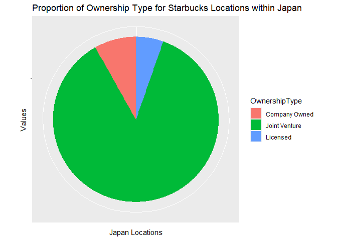

## Instructions

-   You can use the packages `maps`, `dplyr`, `ggplot2` and any packages
    in `Tidyverse`. If you wish to use any additional packages beyond
    “Base R” (the default) and these packages email Rebecca
    (`rkurt001@ucr.edu`) for permission.
-   Use R to answer the questions below.
-   Check Piazza regularly for clarification on questions, there may be
    important posts that will not be announced through *Elearn*.  
-   You can use any iteration technique to answer the prompts below.
-   You are allowed to use outside resources to help with understanding,
    but all work you submit MUST BE YOUR OWN, do not copying things from
    outside sources. In addition, for this assignment there is
    absolutely no communicating with other humans. This includes people
    from class, and online forums (StackOverflow, Chegg, etc.).  
-   Email questions to Jericho (<jlaws011@ucr.edu> ) or Rebecca
    (<rkurt001@ucr.edu>).

## Cumulative-Proportion/Cumulative-Win Plots

Sometimes it is helpful to track things over time, or visualize how the
estimated probability of an event changes as we consider more data. We
can visualize this using a cumulative proportion plot. For example,
suppose we want to estimate how often we can expect a coin to land on a
“head”. We can flip a coin multiple times and record a “1” if it land on
a head, and “0” otherwise. Then we can calculate the proportion of the
times that the coin landed on a head, which is the (arithmetic) mean of
the 0s and 1s. If we only flip the coin a few times, then the proportion
that we calculate may not be accurate due to random fluctuation.
However, the more coin flips we consider the more likely the proportion
we calculate approaches the truth. We can observe this using a
cumulative proportion plot. In a cumulative proportion plot we have the
number of trials on the x-axis, and the estimated proportion of
successes using all data up to trial “x” on the y-axis. For example,
suppose we flip one coin five times and obtain the results 1, 1, 0, 1,
0. Then the proportion of successes using “x” number of trials is the
following.

-   When the number of trials is x = 1, the proportion of times we
    observe a head is y = (1)/1 = 1
-   When the number of trials is x = 2, the proportion of times we
    observe a head is y = (1+1)/2 = 1
-   When the number of trials is x = 3, the proportion of times we
    observe a head is y = (1+1+0)/3 = 2/3
-   When the number of trials is x = 4, the proportion of times we
    observe a head is y = (1+1+0+1)/4 = 3/4
-   When the number of trials is x = 5, the proportion of times we
    observe a head is y = (1+1+0+1+0)/5 = 3/5

An example of a running average for this particular case is posted on
*Elearn*. You can also see an example posted here:
<http://www.rossmanchance.com/applets/2021/randombabies/RandomBabies.html>.
When using cumulative proportion plots for something that results in a
success or a failure, like the coin flip example, we sometimes call this
a “cumulative win plot”.

## Running-Average Plot

A running average plot is the same basic idea, but instead of
considering 1s and 0s for wins and loses, we can consider different
numbers. For example, in statistics when calculating the (arithmetic)
mean, we believe that in general if we use more data our estimated mean
will be more accurate. For instance, suppose we sample the height of UCR
students. The (arithmetic) mean calculated with 50 observations is
likely more accurate the (arithmetic) mean of 2 observations. We can
illustrate this with a running average plot. Just like the cumulative
proportion plot above, the x-axis is integers between 1 and the maximum
number of observations we consider. On the y-axis we have the calculated
(arithmetic) mean for the first `x` number of observations.

## Questions

``` r
library(tidyverse)
```

    ## Warning: package 'tidyverse' was built under R version 4.1.3

    ## -- Attaching packages --------------------------------------- tidyverse 1.3.2 --
    ## v ggplot2 3.3.6     v purrr   0.3.4
    ## v tibble  3.1.8     v dplyr   1.0.9
    ## v tidyr   1.2.0     v stringr 1.4.0
    ## v readr   2.1.2     v forcats 0.5.1

    ## Warning: package 'ggplot2' was built under R version 4.1.3

    ## Warning: package 'tibble' was built under R version 4.1.3

    ## Warning: package 'tidyr' was built under R version 4.1.3

    ## Warning: package 'readr' was built under R version 4.1.3

    ## Warning: package 'purrr' was built under R version 4.1.3

    ## Warning: package 'dplyr' was built under R version 4.1.3

    ## Warning: package 'forcats' was built under R version 4.1.3

    ## -- Conflicts ------------------------------------------ tidyverse_conflicts() --
    ## x dplyr::filter() masks stats::filter()
    ## x dplyr::lag()    masks stats::lag()

``` r
library(maps)
```

    ## Warning: package 'maps' was built under R version 4.1.3

    ## 
    ## Attaching package: 'maps'
    ## 
    ## The following object is masked from 'package:purrr':
    ## 
    ##     map

**Question 1: Simulation Recreation (12 points)**

For this question we will be recreating parts of the simulation from
this
[website](http://www.rossmanchance.com/applets/2021/randombabies/RandomBabies.html).
In this simulation there is a hospital in which a few babies are all
born at the same time. The hospital mixes them up, and the families go
home with a randomly selected baby. The focus is studying the
number/proportion of babies that go to the correct home under various
situations.

1a) (2 point) Create a function with one input:

\-`babies`: Numeric vector of length 1. Represents how many babies are
at the hospital.

In this function generate a vector that has elements (1, 2, 3, 4, …,
`babies`) in a random order. Let (1, 2, 3, …, `babies`) represent the
true order. Count how many elements in the random vector match the true
order and have your function return this number.

For example, suppose `babies = 4`, and a simulation generates the order:
1, 3, 2, 4. Then the function should return 2 because the first and last
baby were correctly matched.

``` r
set.seed(400)
babySimulation <- function(babies){
  randOrder <- sample(1:babies, babies, replace = FALSE)
  trueOrder <- c(1:babies)
  matches <- 0
  for (x in 1:babies){
    if (trueOrder[x] == randOrder[x]){
      matches <- matches + 1
    } else{
      next
    }
  }
  return(matches)
}

babySimulation(4)
```

    ## [1] 2

1b) (3 points) Create a function with two inputs: `babies` and `trial`.
In this function we call our function in Q1a `trial` times, where each
trial has the same number of babies (`babies`). Have this function
return a *named list* with three elements:

-   `Data`: a numeric vector of length `trial` where each element
    contains the number of matches for a particular trial.

-   `CumulativeResults`: a data frame with three columns, “Matches”,
    “Count”, and “Prop”, which resembles that found on this
    [website](http://www.rossmanchance.com/applets/2021/randombabies/RandomBabies.html)

-   `Parameters`: a *named* vector of length 2 that contains `babies`
    and `trial`.

``` r
set.seed(400)
dataSimulation <- function(babies, trial){
  data <- replicate(trial, babySimulation(babies))
  matches <- c(1:babies)
  count <- c()
  count[1] <- length(data[data == 0])
  for (x in matches){
    count[x+1] <- length(data[data == x])
  }
  
  cumulativeResults <- data.frame(Matches = 0:babies, Count = count, Prop = count/trial)
  parameters <- c(babies, trial)
  names(parameters) <- c("Babies", "Trials")
  
  lst <- list(data, cumulativeResults, parameters)
  names(lst) <- c("Data", "Cumulative Results", "Parameters")
  
  return(lst)
}

dataSimulation(4, 4)
```

    ## $Data
    ## [1] 2 2 2 1
    ## 
    ## $`Cumulative Results`
    ##   Matches Count Prop
    ## 1       0     0 0.00
    ## 2       1     1 0.25
    ## 3       2     3 0.75
    ## 4       3     0 0.00
    ## 5       4     0 0.00
    ## 
    ## $Parameters
    ## Babies Trials 
    ##      4      4

1c) (3 points) Create a function that has the following three arguments.
In this function you will either create a cumulative proportion plot for
a particular number of babies that went to the right home, OR a running
average plot (arithmetic mean number of babies that went to the right
home). The plot you create corresponds to the plot(s) in the lower right
of this
[website](http://www.rossmanchance.com/applets/2021/randombabies/RandomBabies.html).

-   `Data`: A numeric vector. This vector should contain the results
    that corresponds to the first element of the returned list from the
    function in Q1b.

-   `PlotType`: A character vector of length 1. If “average” (default),
    then plot a cumulative average plot for the `Data` (the first
    argument for this function). If “relative frequency”, then plot the
    cumulative proportion plot for when `Matches` occurs.

-   `Matches`: A numeric vector of length 1. Contains the scenario to
    calculate the relative frequency plot if
    `PlotType = "relative frequency"` is selected. Can be any whole
    number between 0 and `babies` for the given scenario.

HINT: A loop could be useful for creating the data to be plotted.

``` r
set.seed(400)
plotSimulation <- function(data, plotType, matches){
  trls <- c(1:length(data)) 
  if (plotType == "average"){
    cumAvg <- cummean(data)
    cumAvgData <- as_tibble(cumAvg)
    cumAvgData <- add_column(cumAvgData, trials = trls)
    tbl <- ggplot(cumAvgData, aes(x = trials, y = value)) + geom_point() + expand_limits(x = 0, y = 0) + labs(x = "Number of Trials", y = "Average Matches")
  } else if (plotType == "relative frequency"){
    relFreq <- c()
    count <- 0
    for (x in trls){
      if (data[x] == matches){
        count <- count + 1
        relFreq[x] <- count / x
      } else{
        relFreq[x] <- count / x
      }
    }
    relFreqData <- as_tibble(relFreq)
    relFreqData <- add_column(relFreqData, trials = trls)
    tbl <- ggplot(relFreqData, aes(x = trials, y = value)) + geom_point() + expand_limits(x = 0, y = 0) + labs(x = "Number of Trials", y = "Relative Frequency")
  }
  return(tbl)
}

tst <- dataSimulation(4, 4)
dta <- unname(unlist(tst[1]))
plotSimulation(dta, "average", 2)
```


``` r
plotSimulation(dta, "relative frequency", 2)
```


1d) (2 points) Use your functions above to generate 500 trials for when
there are 7 babies. Output/Display:

-   `CumulativeResults` table for your trials

-   The cumulative average plot

-   The relative frequency plot for when there are exactly two matches.

``` r
set.seed(400)
simulationData <- dataSimulation(7, 500)
data <- unname(unlist(simulationData[1]))
simulationData[2]
```

    ## $`Cumulative Results`
    ##   Matches Count  Prop
    ## 1       0   191 0.382
    ## 2       1   169 0.338
    ## 3       2    86 0.172
    ## 4       3    39 0.078
    ## 5       4    11 0.022
    ## 6       5     4 0.008
    ## 7       6     0 0.000
    ## 8       7     0 0.000

``` r
plotSimulation(data, "average", 2)
```


``` r
plotSimulation(data, "relative frequency", 2)
```


1e) (2 points) Create a bar chart using that corresponds to your results
in Q1d. It should somewhat resemble the plot in the lower left corner
from this
[website](http://www.rossmanchance.com/applets/2021/randombabies/RandomBabies.html).
It should be professional, have an appropriate title, labels, colors,
etc. Change the color scheme to be something other than the default. You
can use `ggplot` or base R.

``` r
df <- as.data.frame(simulationData[2])
barPlt <- ggplot(df, aes(x = factor(Cumulative.Results.Matches), y = Cumulative.Results.Count, fill = Cumulative.Results.Matches)) + geom_col() + labs(title = "Frequency Of Babies Successfully Matched Over 500 Trials", x = "Matches", y = "Number of Matches")
barPlt
```


**Question 2: Taylor Swift Albums (9 points)**

Load the data set `TaylorSwift.csv` from *ELearn*. This is a *modifed*
data set from
<https://www.kaggle.com/thespacefreak/taylor-swift-song-lyrics-all-albums>.
Each row corresponds to a particular line/lyric for a particular song
and album by Taylor Swift.

``` r
tswift <- read.csv("C:\\Users\\Swift\\Downloads\\TaylorSwift.csv")
head(tswift)
```

    ##     album_name track_title track_n                                       lyric
    ## 1 Taylor Swift  Tim McGraw       1         He said the way my blue eyes shined
    ## 2 Taylor Swift  Tim McGraw       1 Put those Georgia stars to shame that night
    ## 3 Taylor Swift  Tim McGraw       1                      I said, "That's a lie"
    ## 4 Taylor Swift  Tim McGraw       1                 Just a boy in a Chevy truck
    ## 5 Taylor Swift  Tim McGraw       1        That had a tendency of gettin' stuck
    ## 6 Taylor Swift  Tim McGraw       1                      On back roads at night
    ##   line
    ## 1    1
    ## 2    2
    ## 3    3
    ## 4    4
    ## 5    5
    ## 6    6

2a) (2 points) Create a 2D object (data frame or tibble) that has the
following columns for each track for each album (that is, each row
corresponds to a particular track in a particular album). Have this data
set contain the following columns:

-   `Album`: The name of the album the track is on

-   `TrackTitle`: The name of the given track

-   `TrackNum`: Which track number this is for the given album

-   `NumLines`: Total number of lines for the given track

Organize the 2D object by album name, and then by track number. Display
the first few rows.

``` r
grpSwift <- tswift %>% group_by(track_title) %>% slice_max(n = 1, line)
tswiftTibble <- grpSwift %>% select(album_name, track_title, track_n, line) %>% arrange(album_name) %>% relocate(track_n, .before = track_title) %>% distinct(album_name, track_n, track_title, line) %>% arrange(album_name, track_n)
head(tswiftTibble)
```

    ## # A tibble: 6 x 4
    ## # Groups:   track_title [6]
    ##   album_name track_n track_title                 line
    ##   <chr>        <int> <chr>                      <int>
    ## 1 1989             1 Welcome to New York           44
    ## 2 1989             2 Blank Space                   85
    ## 3 1989             3 Style                         48
    ## 4 1989             4 Out of the Woods              71
    ## 5 1989             5 All You Had to Do Was Stay    67
    ## 6 1989             6 Shake It Off                  77

2b) (3 points) Create a subset of all rows of the data set created in
Q2a where the track titles are also the album title. Show how to do this
using THREE different techniques (i.e. indexing, tidyverse, apply
functions, loops, subset(), etc.). NOTE: You are allowed to use multiple
different indexing techniques.

``` r
indexing <- tswiftTibble[tswiftTibble$album_name == tswiftTibble$track_title, ]
indexing
```

    ## # A tibble: 2 x 4
    ## # Groups:   track_title [2]
    ##   album_name  track_n track_title  line
    ##   <chr>         <int> <chr>       <int>
    ## 1 "Fearless "       1 "Fearless "    39
    ## 2 "Lover"           3 "Lover"        33

``` r
subsetting <- subset(tswiftTibble, tswiftTibble$album_name == tswiftTibble$track_title)
subsetting
```

    ## # A tibble: 2 x 4
    ## # Groups:   track_title [2]
    ##   album_name  track_n track_title  line
    ##   <chr>         <int> <chr>       <int>
    ## 1 "Fearless "       1 "Fearless "    39
    ## 2 "Lover"           3 "Lover"        33

``` r
filtering <- tswiftTibble %>% filter(album_name == track_title)
filtering
```

    ## # A tibble: 2 x 4
    ## # Groups:   track_title [2]
    ##   album_name  track_n track_title  line
    ##   <chr>         <int> <chr>       <int>
    ## 1 "Fearless "       1 "Fearless "    39
    ## 2 "Lover"           3 "Lover"        33

2c) (2 points) Create a plot for the data set created in Q2a. Have this
plot display the relationship between the total number of lines for each
track, track number, and album. Your plot should be professional, and
have appropriate labels/scales/colors/legends.

``` r
tswiftPlot <- ggplot(tswiftTibble, aes(x = line, y = album_name, fill = track_n)) + geom_col() + labs(title = "Relationship between Albums, Track numbers, and amount of Lines", x = "Total number of lines for each track per album", y = "Album Names")
tswiftPlot
```


2d) (2 point) Describe what you plotted in Q2c in detail. What type of
plot did you create? If there are axis, describe them. If there is a
color scheme, or other aspects of the plot that change by a variable,
describe them as well.

The type of plot I made is a horizontal boxplot using ggplot. The y-
axis represents all of the album names present within the dataset while
the x-axis represents the total number of lines present throughout each
album. This relationship is further supported by the color scheme which
depicts the relationship between the track numbers of each album and how
many lines they contribute to the total album line count. This is
represented within the graph with some albums having a higher
contribution rate from the 1st half of the album such as reputation and
others by the second half of the album like fearless.

**Question 3: Getting Familiar with the Starbucks Data Set (10 points)
**

For this question you need the `Starbucks.csv` data set on ELearn. This
data set comes from
[Kaggle.com](https://www.kaggle.com/starbucks/store-locations) and
contains general information about all the Starbucks locations worldwide
as of February 2017.

``` r
starbucks <- read.csv("C:\\Users\\Swift\\Downloads\\starbucks.csv")
```

3a) (1 point) Create a 2D object (data frame or tibble) called
`usa_starbucks` that only contains the Starbucks locations that are in
the United States. Output the first few observations of this tibble.
HINT: Check the columns `Brand`, AND `Country`.

``` r
usa_starbucks <- starbucks %>% filter(Country == "US")
head(usa_starbucks)
```

    ##       Brand Store.Number                 Store.Name OwnershipType
    ## 1 Starbucks  3513-125945    Safeway-Anchorage #1809      Licensed
    ## 2 Starbucks  74352-84449    Safeway-Anchorage #2628      Licensed
    ## 3 Starbucks 12449-152385  Safeway - Anchorage #1813      Licensed
    ## 4 Starbucks 24936-233524   100th & C St - Anchorage Company Owned
    ## 5 Starbucks   8973-85630       Old Seward & Diamond Company Owned
    ## 6 Starbucks  72788-84447 Fred Meyer - Anchorage #11      Licensed
    ##                                              Street.Address      City
    ## 1                                      5600 Debarr Rd Ste 9 Anchorage
    ## 2                                            1725 Abbott Rd Anchorage
    ## 3                                           1501 Huffman Rd Anchorage
    ## 4 320 W. 100th Ave, 100, Southgate Shopping Ctr - Anchorage Anchorage
    ## 5                                        1005 E Dimond Blvd Anchorage
    ## 6                               1000 E Northern Lights Blvd Anchorage
    ##   StateProvince Country  Postcode   Phone.Number                    Timezone
    ## 1            AK      US 995042300   907-339-0900 GMT-09:00 America/Anchorage
    ## 2            AK      US 995073444   907-339-2800 GMT-09:00 America/Anchorage
    ## 3            AK      US 995153596   907-339-1300 GMT-09:00 America/Anchorage
    ## 4            AK      US     99515 (907) 227-9631 GMT-09:00 America/Anchorage
    ## 5            AK      US 995152050   907-344-4160 GMT-09:00 America/Anchorage
    ## 6            AK      US 995084218   907-264-9600 GMT-09:00 America/Anchorage
    ##   Longitude Latitude
    ## 1   -149.78    61.21
    ## 2   -149.84    61.14
    ## 3   -149.85    61.11
    ## 4   -149.89    61.13
    ## 5   -149.86    61.14
    ## 6   -149.87    61.19

3b) (2 points) Use `map()` function for the `maps` package to create a
plot of all the Starbucks locations that are in the United States (you
do not have to consider Alaska or Hawaii). Have the points on the map
differ according to the `Ownership.Type` column. Include a legend in
your plot.

``` r
map("state")

points(usa_starbucks$Longitude, usa_starbucks$Latitude, col = unique(factor(usa_starbucks$OwnershipType)))

legend(x = "bottomleft", legend = unique(factor(usa_starbucks$OwnershipType)), fill = unique(factor(usa_starbucks$OwnershipType)))
```


3c) (3 points) Create a 2D object (data frame or tibble) where each row
corresponds to a state in the `usa_starbucks` tibble, and has the
following columns: - City name for the most amount of Starbucks
locations in the state. - (arithmetic) mean longitude values for the
given city - (arithmetic) mean latitude values for the given city -
total number of Starbucks locations for the given city. There should be
a total of 51 rows when we count all states and Washington DC.

``` r
tibby1 <- usa_starbucks %>% group_by(City) %>% summarise_at(vars(Longitude, Latitude), mean)
tibby2 <- usa_starbucks %>% group_by(StateProvince) %>% count(City) %>% slice_max(n = 1, n) %>%  distinct(StateProvince, .keep_all = TRUE)
starbucksTibble <- left_join(tibby2, tibby1, by = 'City')
starbucksTibble <- relocate(starbucksTibble, n, .after = Latitude)
starbucksTibble <- rename(starbucksTibble, c(StarbucksCapital = City, AverageLongitude = Longitude, AverageLatitude = Latitude, TotalStarbucksLocations = n))
starbucksTibble
```

    ## # A tibble: 51 x 5
    ## # Groups:   StateProvince [51]
    ##    StateProvince StarbucksCapital AverageLongitude AverageLatitude TotalStarbu~1
    ##    <chr>         <chr>                       <dbl>           <dbl>         <int>
    ##  1 AK            Anchorage                  -150.             61.2            24
    ##  2 AL            Birmingham                  -86.4            34.5            16
    ##  3 AR            Little Rock                 -92.3            34.7            16
    ##  4 AZ            Phoenix                    -112.             33.6           104
    ##  5 CA            San Diego                  -117.             32.8           135
    ##  6 CO            Denver                     -105.             39.7            78
    ##  7 CT            Stamford                    -73.5            41.1             7
    ##  8 DC            Washington                  -77.2            38.9            87
    ##  9 DE            Newark                      -88.6            39.3             8
    ## 10 FL            Miami                       -80.8            25.9            54
    ## # ... with 41 more rows, and abbreviated variable name
    ## #   1: TotalStarbucksLocations
    ## # i Use `print(n = ...)` to see more rows

3d) (2 points) Plot the longitude and latitude coordinates found in the
previous problem using the `maps` package. The following code is the
longitude and latitude coordinates for each state capital. Plot the
state capital points below as well, but use a different color or shape.
Make sure there is a legend for your plot.

This will create a map of the capitals for each state, and the
“Starbucks Capital” for each state.

``` r
# Coordinates for US State Capitals 
us_cities <- us.cities[us.cities$capital==2, ]
map("state")
points(us_cities$long, us_cities$lat, pch = 22, col = "blue")
points(starbucksTibble$AverageLongitude, starbucksTibble$AverageLatitude, pch = 24, col = "purple")

legend(x = "bottomleft", legend = c("State Capital", "Starbucks Capital"), fill = c("blue", "purple"))
```


3e) (2 points) Generate a plot of your choice that compares
`OwnershipType` between `USA` and another country of your choice. (HINT:
A `geom_bar()` using `ggplot`, or a pie chart might work well, but you
are not limited to this.)

``` r
jp_starbucks <- starbucks %>% filter(Country == "JP")

pie1 <- ggplot(usa_starbucks, aes(x = "", y = Country, fill = OwnershipType)) + geom_col() + coord_polar(theta = "y") + labs(title = "Proportion of Ownership Type for Starbucks Locations within the US", x = "Values", y = "United States Locations")

pie2 <- ggplot(jp_starbucks, aes(x = "", y = Country, fill = OwnershipType)) + geom_col() + coord_polar(theta = "y") + labs(title = "Proportion of Ownership Type for Starbucks Locations within Japan", x = "Values", y = "Japan Locations")

pie1
```


``` r
pie2
```


